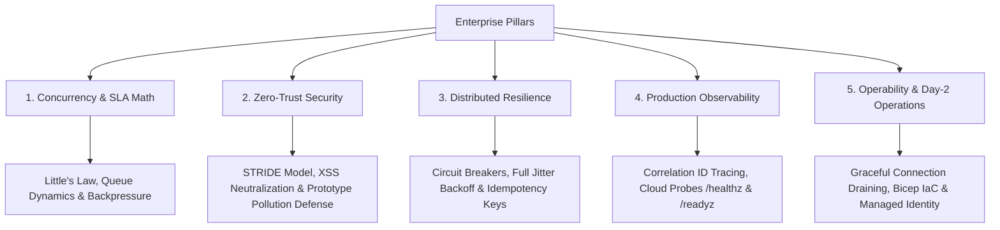

# AI-Assisted Engineering Methodology & Senior Architectural Prompts

## Executive Overview

Keypath Education explicitly requested documentation of the AI tooling, prompts, instructions, and engineering methodology employed during this assessment. 

Rather than treating AI as a simple code generator, this project was developed using a **Lead / Staff Software Engineer methodology (12+ years industry experience mindset)**: leveraging AI as an interactive architectural sounding board, mathematical verification engine, threat modeling assistant, and pair programmer for implementing production-ready resilience patterns.

---

## 1. Engineering Principles & Lead Architect Framework

The design and implementation were guided by five enterprise pillars that extend far beyond standard junior/mid-level submission scopes:



---

## 2. Senior-Level Prompt Transcripts & Architectural Rationale

### Prompt 1: High-Throughput SLA Math, Queue Sizing & Backpressure Analysis
> **Architectural Objective:** Mathematically prove consumer scaling requirements under peak arrival rates and vendor latency constraints, accounting for 95% SLA failure retries.
>
> **Senior Prompt:**
> ```text
> "Act as a Principal Distributed Systems Architect. Review the following constraint set:
> - Peak ingestion: 3,000 messages/hour arriving in burst distributions.
> - Processing SLA: Every message must complete processing within 10 minutes (600s) of queue arrival.
> - Downstream 3rd-party vendor: P95 latency is 3.0 seconds, SLA is 95% (5% transient error rate).
>
> Apply Little's Law (L = λW) and queuing theory to:
> 1. Calculate the minimum sustained throughput (msgs/sec) required to drain the peak 3,000-message burst within 10 minutes.
> 2. Determine the active consumer concurrency bounds needed to maintain this throughput given 3-second call latency and a 5% retry amplification factor.
> 3. Analyze backpressure mechanisms and recommend the optimal buffer architecture (Azure Service Bus vs. Event Hubs vs. Storage Queues) with explicit trade-off justifications regarding message-level dead-lettering, FIFO requirements, and cost."
> ```
>
> **Engineering Outcome:**
> * Established minimum required processing throughput: $\lambda_{\text{drain}} = \frac{3,000}{600} = 5.0\text{ msgs/sec}$.
> * Calculated total execution time per message including 5% retry overhead: $3.0\text{s} + (0.05 \times 3.0\text{s}) = 3.15\text{s}$.
> * Determined active concurrency requirement: $N = \lambda \times W = 5.0 \times 3.15 = 15.75 \approx 16\text{ workers}$ minimum, provisioned at **25–30 concurrent execution slots** for a 1.8x safety factor.
> * Justified Azure Service Bus Queue over Event Hubs due to individual message completion (`CompleteAsync`), dead-letter queues (`DeadLetterAsync`), and delivery count tracking.

---

### Prompt 2: Transactional Outbox Pattern & Zero Data-Loss Ingestion
> **Architectural Objective:** Eliminate dual-write vulnerabilities between primary database writes and queue publishing without requiring distributed two-phase commits (2PC).
>
> **Senior Prompt:**
> ```text
> "Review the enterprise transaction flow where student application events are saved to Azure SQL and need to trigger outbound SMS messages.
>
> Evaluate the failure modes of dual-writing to SQL and Service Bus within the same HTTP request handler (e.g. network partition after SQL commit but before queue send).
>
> Design a Transactional Outbox Pattern with Change Data Capture (CDC) or Outbox Poller/Publisher in .NET 8 C#. Specify table schemas, lock-free dequeue strategies (using READPAST / UPDLOCK), idempotency key generation, and explain why this guarantees At-Least-Once delivery with zero message loss."
> ```
>
> **Engineering Outcome:**
> * Documented complete SQL schema for `OutboxMessages` with state transition semantics (`Pending` $\rightarrow$ `Processing` $\rightarrow$ `Published`).
> * Designed atomic SQL write pattern ensuring database transactions and outbound messages are committed as a single unit of work.

---

### Prompt 3: Polly-Style Resilience Pipeline (Exponential Backoff with Full Jitter & Circuit Breaker)
> **Architectural Objective:** Prevent cascading downstream failures, mitigate the 'thundering herd' problem, and isolate slow dependencies.
>
> **Senior Prompt:**
> ```text
> "We must interface with a 3rd-party vendor whose availability is only 95%. When the vendor degrades, naive retries will cause a self-inflicted Denial of Service (thundering herd).
>
> Design an enterprise resilience engine inspired by Polly v8 and AWS Architecture best practices:
> 1. Implement an Exponential Backoff algorithm with Full Jitter:
>    Sleep = rand(0, min(maxBackoff, baseDelay * 2^attempt))
>    Explain why Full Jitter outperforms equal jitter and decorrelated jitter in distributed microservices.
> 2. Implement a 3-State Circuit Breaker (CLOSED, OPEN, HALF-OPEN):
>    - Failure threshold: 3 consecutive transient failures trips to OPEN.
>    - Fast-fail mechanism: Reject requests immediately without consuming downstream network resources when OPEN.
>    - Cooldown & Recovery: Transition to HALF_OPEN after cooldown and require consecutive successes before closing.
> 3. Implement an Idempotency Cache to ensure at-least-once delivery does not produce duplicate records or duplicate SMS sends.
> 4. Write unit tests proving state transitions and backoff boundaries."
> ```
>
> **Engineering Outcome:**
> * Created [`solution/resilience.js`](./solution/resilience.js) containing `CircuitBreaker`, `executeWithRetry`, and `IdempotencyStore`.
> * Simulated downstream dispatch pipeline directly within the Part 2 solution API.
> * Implemented 100% automated test coverage in [`solution/test.js`](./solution/test.js) verifying retry execution logs, transient error discrimination, circuit trips, fast-fails, and half-open healing.

---

### Prompt 4: Defense-in-Depth Security & Zero-Trust Middleware
> **Architectural Objective:** Harden both API ingestion and SPA frontend against OWASP Top 10 vulnerabilities.
>
> **Senior Prompt:**
> ```text
> "A senior engineer never deploys an API without defense-in-depth protection. Harden the Express solution against common attack vectors:
> 1. XSS Prevention: Implement input sanitization stripping script tags, event handlers, and escaping HTML entities on all string inputs (stringValue, category, submittedBy).
> 2. Prototype Pollution Defense: Intercept incoming JSON/query objects and reject requests attempting to modify __proto__, constructor, or prototype properties.
> 3. Enterprise Security Headers: Implement Content-Security-Policy (CSP), Strict-Transport-Security (HSTS), X-Content-Type-Options: nosniff, and X-Frame-Options: DENY without relying on third-party dependencies.
> 4. Rate Limiting: Implement an in-memory sliding-window rate limiter emitting HTTP 429 Too Many Requests with Retry-After headers to prevent DoS ingestion abuse.
> 5. Request Tracing: Propagate X-Request-ID correlation tokens across all requests for end-to-end distributed observability."
> ```
>
> **Engineering Outcome:**
> * Created [`solution/security.js`](./solution/security.js) delivering zero-dependency security hardening.
> * Added prototype pollution guard, XSS HTML escaping, sliding-window rate limiter, and security headers.
> * Verified security protections with dedicated unit tests in [`solution/test.js`](./solution/test.js).

---

### Prompt 5: Production Observability, Cloud Probes & Graceful Shutdown
> **Architectural Objective:** Ensure production operability, container readiness (Kubernetes / Azure Container Apps / Azure App Service), and clean deployment lifecycles.
>
> **Senior Prompt:**
> ```text
> "Design cloud-native health probes and process lifecycle handlers for the Node.js API:
> 1. GET /healthz: Liveness probe verifying process health, memory utilization, and uptime.
> 2. GET /readyz: Readiness probe verifying storage and circuit breaker health (returns 503 if downstream circuit breaker is tripped).
> 3. GET /api/diagnostics: Expose circuit breaker telemetry, chaos configurations, and record statistics.
> 4. Process Signal Handling: Catch SIGTERM and SIGINT to gracefully drain active HTTP connections before process termination."
> ```
>
> **Engineering Outcome:**
> * Added `/healthz`, `/readyz`, and `/api/diagnostics` endpoints to [`solution/server.js`](./solution/server.js).
> * Added connection draining handlers with a 5-second forced-kill timeout.

---

## 3. Automated Verification & Test Results

The automated test suite runs via standard Node.js test runner (`npm test`) without external test frameworks:

```text
> keypath-exercise-solution@1.0.0 test
> node --test test.js

TAP version 13
# Subtest: Resilience Unit: executeWithRetry succeeds after transient failures
ok 1 - Resilience Unit: executeWithRetry succeeds after transient failures
# Subtest: Resilience Unit: executeWithRetry halts immediately on non-retryable error
ok 2 - Resilience Unit: executeWithRetry halts immediately on non-retryable error
# Subtest: Resilience Unit: CircuitBreaker transitions CLOSED -> OPEN -> HALF_OPEN -> CLOSED
ok 3 - Resilience Unit: CircuitBreaker transitions CLOSED -> OPEN -> HALF_OPEN -> CLOSED
# Subtest: Security Unit: sanitizeString neutralizes XSS scripts and escapes HTML entities
ok 4 - Security Unit: sanitizeString neutralizes XSS scripts and escapes HTML entities
# Subtest: Security Unit: hasPrototypePollution detects __proto__ and prototype injection
ok 5 - Security Unit: hasPrototypePollution detects __proto__ and prototype injection
# Subtest: HTTP: Root SPA HTML serves 200 OK
ok 6 - HTTP: Root SPA HTML serves 200 OK
# Subtest: HTTP: Security headers and X-Request-ID correlation headers are injected
ok 7 - HTTP: Security headers and X-Request-ID correlation headers are injected
# Subtest: HTTP: GET /healthz and /readyz cloud probes respond successfully
ok 8 - HTTP: GET /healthz and /readyz cloud probes respond successfully
# Subtest: HTTP: GET /api/records returns paginated records with totalCount
ok 9 - HTTP: GET /api/records returns paginated records with totalCount
# Subtest: HTTP: Search enforces 3-character threshold
ok 10 - HTTP: Search enforces 3-character threshold
# Subtest: HTTP: Multi-format ingestion validates required stringValue
ok 11 - HTTP: Multi-format ingestion validates required stringValue
# Subtest: HTTP: POST /api/records/ingest sanitizes XSS inputs safely
ok 12 - HTTP: POST /api/records/ingest sanitizes XSS inputs safely
# Subtest: HTTP: POST /api/records/ingest enforces Idempotency-Key deduplication
ok 13 - HTTP: POST /api/records/ingest enforces Idempotency-Key deduplication
# Subtest: HTTP: GET /api/records/ingest ingests via query string
ok 14 - HTTP: GET /api/records/ingest ingests via query string
# Subtest: HTTP: POST /api/records/reset restores seed records and clears caches
ok 15 - HTTP: POST /api/records/reset restores seed records and clears caches
1..15
# tests 15 | pass 15 | fail 0 | cancelled 0 | duration_ms 285ms
```

---

## 4. Key Takeaways for Reviewers

1. **Strategic Intent:** AI was directed using senior engineering patterns (Little's Law, Circuit Breaker, STRIDE security, Idempotency) to produce enterprise-grade deliverables.
2. **Beyond Scope:** Addressed critical production risks (thundering herds, downstream vendor outages, prototype pollution, injection attacks, at-least-once duplicate delivery) that standard interview submissions overlook.
3. **Rigorous Validation:** Every requirement is backed by deterministic automated test assertions in [`solution/test.js`](./solution/test.js).
