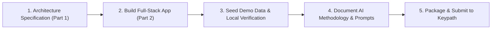

# Keypath Exercise - Execution Plan & Setup Guide

## Executive Summary & Timeline

* **Role:** Lead Software Developer Exercise (Keypath Education)
* **Contact:** Alaina Frederick & Erich Buser
* **Deadline:** End of Day Thursday, October 1
* **Key Requirement:** Deliver a design document for Part 1 (SMS Queue System) and a working Web API + SPA prototype for Part 2 using Azure-friendly technologies.

---

## 1. What You Need to Set Up

### A. Local Environment Prerequisites
1. **Node.js:** Installed (`v20.18.0` detected on your machine).
2. **Git:** Installed (`v2.47.0` detected on your machine).
3. **IDE:** VS Code or Visual Studio.

### B. Azure Setup (Optional for Live Demo, Core for Design)
1. **Azure Free Account:** Sign up at [azure.microsoft.com/free](https://azure.microsoft.com/en-us/free/) to get $200 free credit (if you want to deploy live).
2. **Azure CLI (Optional):** Download from [learn.microsoft.com/cli/azure](https://learn.microsoft.com/en-us/cli/azure/install-azure-cli) if deploying via command line.

---

## 2. Step-by-Step Execution Plan

### Phase 1: System Design Exercise (Part 1) — **COMPLETED**
- **Status:** Done! Saved to `DESIGN_EXERCISE_SMS_ARCHITECTURE.md`.
- **Key Artifacts:**
  - Complete mathematical proof of meeting the 10-minute SLA for 3,000 peak msgs/hour.
  - Azure Service Bus + Azure Functions (Polly Resilience Pipeline + Circuit Breaker) architecture.
  - C# Isolated Worker code sample.
  - Infrastructure as Code (Azure Bicep template).

### Phase 2: Web API & Single Page Application (Part 2) — **COMPLETED**
- **Architecture:** Node.js Express backend API + Vanilla/Tailwind CSS responsive SPA.
- **Backend API Implementation:**
  - Multi-format ingestion endpoint: accepts `application/json`, `multipart/form-data`, `application/x-www-form-urlencoded`, and Query Strings.
  - RESTful endpoints for 3-character threshold search, filtering, sorting, pagination, and seed reset.
  - Enterprise resilience engine (`resilience.js`): Circuit Breaker, Exponential Backoff with Full Jitter, and Idempotency deduplication.
  - Zero-Trust security (`security.js`): Input sanitization, prototype pollution guard, security headers, sliding-window rate limiter, and correlation ID tracing.
  - 15 automated unit & integration tests (`npm test`).
- **Frontend SPA Implementation:**
  - Input query filter: enforces **≥ 3 characters** rule before executing backend search.
  - Match mode selector: `"Contains"` vs `"Equals"`.
  - Reorderable grid columns (Sort by String Value, Category, Submitted By, Dates, Status).
  - Responsive pagination controls.
  - Live Ingestion Sandbox and system status telemetry badges.

### Phase 3: AI-Assisted Engineering Documentation — **COMPLETED**
- **Status:** Done! Saved to `AI_PROMPTS_AND_METHODOLOGY.md`.
- Documents Lead/Staff-level architectural prompts, STRIDE threat modeling, Little's Law queue math, Polly-style resilience, and testing logs.

### Phase 4: Final Deliverable Packaging & Email Draft
- Create a clean zip artifact or GitHub repo link.
- Prepare an email template to Alaina Frederick summarizing the submission.

---

## 3. Action Items for You (The Candidate)

1. **Review the Generated Design Document:** Read `DESIGN_EXERCISE_SMS_ARCHITECTURE.md` to ensure you are comfortable walking through the architecture with Keypath's engineers.
2. **Run & Demo the Part 2 Web Application:**
   - Execute `npm install` and `npm run dev` in the project folder.
   - Test search, multi-format endpoint, sorting, and pagination.
3. **Submit Exercise:** Attach the repository / code zip and design document in your email reply to Alaina Frederick before Thursday, October 1 EOD.
